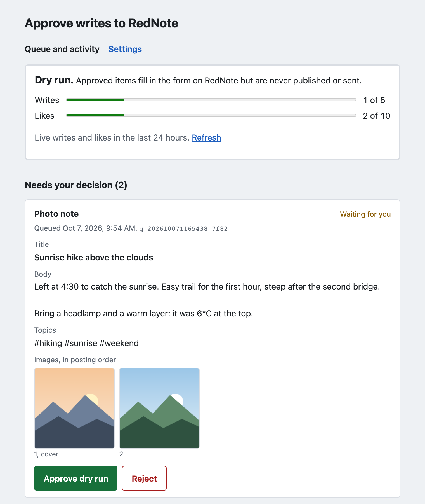

# rednote-gate

[English](README.md)

rednote-gate 只能用在一个专门准备的小号上，也就是丢了也不心疼的账号。不要用在主号或品牌号上。它靠浏览器自动化操作小红书网页，这违反小红书的用户协议。账号可能被限流，也可能被封。



## 这是什么

rednote-gate 是一个本地 MCP 服务器，支持 Claude Code、Claude Desktop 和 Codex。它在你自己的电脑上用 Playwright 打开浏览器，操作一个小红书账号。

- 读操作直接运行：搜索笔记，读取笔记和评论，列出自己的笔记。
- 写操作先进队列：发图文或视频笔记、存草稿、评论、回复、点赞。每一条都要你在本机页面上点 Approve（批准）才会执行。

## 平台规则和封号风险

用浏览器自动化操作小红书网页，本身就违反平台规则。2026 年小红书又发了两份相关公告（2026-10-07 核对）：

- 2026-03-10，小红书发布公告，治理“AI 托管”账号（[IT之家报道](https://www.ithome.com/0/927/689.htm)）。普通账号偶尔用 AI 托管代写、代发笔记或互动，会被警告、限制分发。直接通过 AI 托管工具注册、发布、互动的账号会被封禁。主页公开笔记全部由 AI 托管代发的账号，也会被封禁。
- 2026-04-27，小红书发布 AI 内容治理规则（[IT之家报道](https://www.ithome.com/0/944/156.htm)）。笔记由 AI 生成或经 AI 润色，创作者应在发布时主动标识。没有标识的 AI 内容，平台识别后会统一加上标识。利用 AI 违规运营账号，平台会按情节轻重梯度处置，最重封号。

点了 Approve，账号也不会因此合规。一个只通过 rednote-gate 发笔记的小号，正好符合公告里的封禁情形。风险由你自己承担。

## 安装

需要 Node 20 或更高版本、一个专门注册的小红书账号，以及登录这个账号的手机。

```bash
npm install -g rednote-gate
rednote-gate setup
```

`setup` 会安装 Chromium，打开二维码登录页面（用小号的手机扫码），再把 rednote-gate 接入 Claude Code。数据和登录信息保存在 `~/.rednote-gate`。登录文件和密码一样重要，不要分享，也不要提交到 git。

Claude Desktop 和 Codex 的配置方法见[英文 README](README.md#wiring-into-claude-code-claude-desktop-and-codex)。

## 批准流程

1. 你让 Claude 做事，比如“用这两张照片发一篇爬山的笔记”。
2. Claude 调用写入工具（tools）。内容只进入队列，不会打开小红书。
3. 本机的批准页面（`127.0.0.1`）自动打开，显示要发的标题、正文和图片。你点 Approve 或 Reject。
4. 点 Approve 后还有 30 秒可以取消。之后由你电脑上的浏览器执行，页面会显示结果截图。

默认是 dry run（演练）模式：会填好表单，但不点最后的发布按钮。确认演练结果没问题，再运行 `rednote-gate live` 切换到正式模式。`rednote-gate dry` 切回演练。

在聊天里对 Claude 说“可以，发吧”没有用。只有你在页面上点 Approve 才算数。

不要在同一个会话里加载浏览器类 MCP 服务器，比如 `@playwright/mcp`。带浏览器的 AI 可以自己打开批准页面，替你点 Approve。

默认每天最多 5 次写入、10 次点赞，两条评论之间至少隔 10 分钟。这些限制写在代码里。遇到验证码或“操作频繁”提示，它会全部停下，等你在页面上点 Resume 才继续。它不会破解验证码，也不会重试。

## 各部分怎么配合

| 部分 | 在这里 |
| --- | --- |
| 主机（host） | Claude Code、Claude Desktop 或 Codex，也就是你对话的 AI 应用 |
| 客户端（client） | 主机里的连接器，每个服务器一个，由主机提供 |
| 服务器（server） | rednote-gate，一个本地 MCP 服务器。主机启动它，通过 stdio 通信。 |
| 工具（tools），15 个 | 5 个读取工具直接运行。6 个写入工具只进队列。4 个本地工具不碰小红书。 |
| 提示词（prompts），6 个 | `post_photos`、`post_from_concept`、`reply_to_comments`、`research_topic`、`review_queue`、`help`。Claude Code 把它们显示为斜杠命令。 |
| 资源（resources） | 没有 |

工具由模型调用，提示词由你选择。后台服务、批准页面和 `rednote-gate` 命令行都不属于 MCP。批准页面是本机 127.0.0.1 上的网页。它故意放在 MCP 之外，这样模型没法批准自己的写操作。

## 更多内容

全部工具、设置页面、环境变量、已知限制和安全说明，请看[英文 README](README.md)。

MIT 许可。rednote-gate 是独立项目，与小红书没有任何关联。
